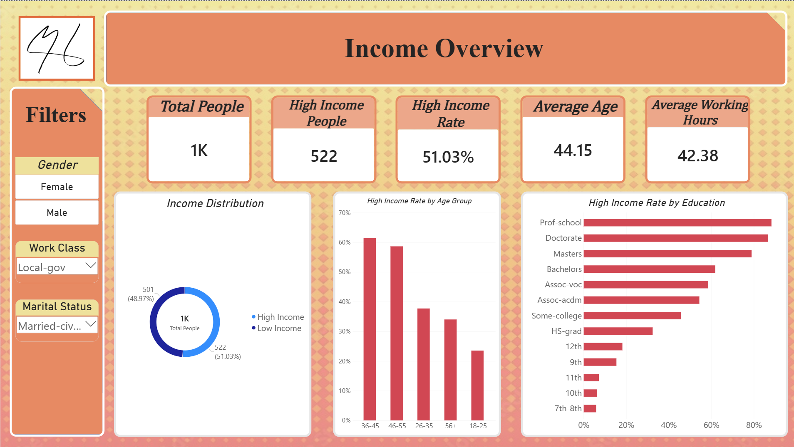
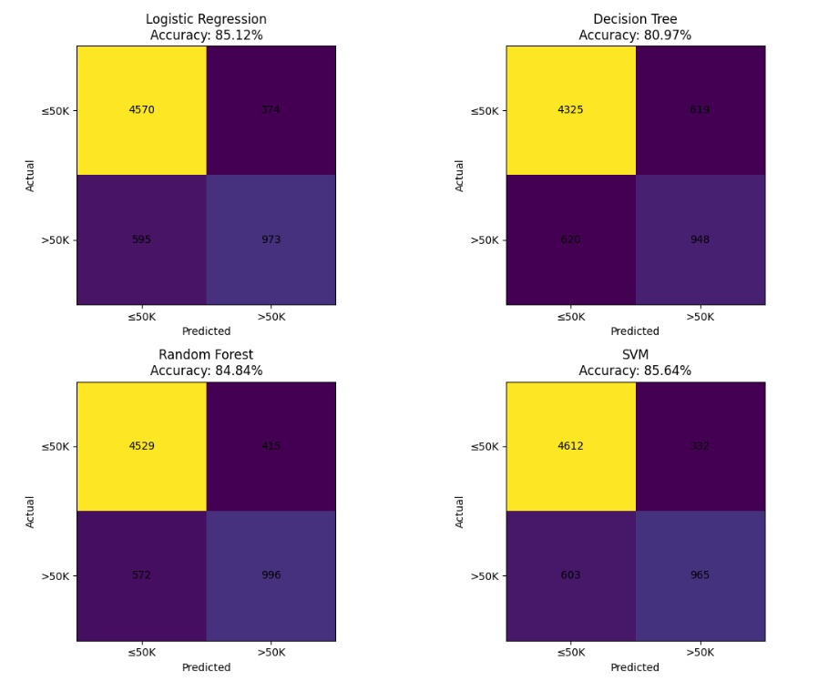

# Adult Income Analysis & Prediction

**Data Analysis with AI Training – Orange Digital Hub Graduation Project**

An end-to-end data analytics and machine learning project using the **Adult Income Dataset** to analyze the factors associated with income level and predict whether an individual earns more than $50K per year.

## Project Overview

This project demonstrates a complete data analytics workflow:

**Data Cleaning → Exploratory Data Analysis → Data Visualization → Power BI Dashboard → Machine Learning → AI-Assisted Insights**

The project combines Python-based analysis, interactive Power BI visualization, and machine learning classification.

## Objectives

* Clean and prepare the Adult Income dataset.
* Explore demographic, educational, and employment-related factors.
* Identify patterns associated with income levels.
* Build an interactive Power BI dashboard.
* Train machine learning classification models to predict income level.
* Evaluate model performance using classification metrics and a confusion matrix.
* Generate actionable insights from the analysis.

## Dataset

**Dataset:** Adult Income Dataset
**Source:** Kaggle
**Original Size:** 32,561 rows × 15 columns

The dataset contains demographic, educational, and employment-related information, including:

* Age
* Work Class
* Education
* Education Number
* Marital Status
* Occupation
* Relationship
* Race
* Sex
* Capital Gain
* Capital Loss
* Hours per Week
* Native Country
* Income Label

The target variable represents whether an individual earns:

* `<=50K`
* `>50K`

## Data Cleaning & Preparation

The data preparation process included:

* Handling missing and unknown values.
* Replacing `?` values with `Not Recorded`.
* Checking and handling duplicate records.
* Reviewing data types and column consistency.
* Preparing categorical and numerical features for analysis and machine learning.
* Creating an **Age Group** feature for dashboard analysis.

The cleaned dataset was then used for exploratory analysis, visualization, and machine learning.

## Exploratory Data Analysis

Python was used to investigate relationships between income and different demographic and employment characteristics.

The analysis explored:

* Income distribution
* Age and income
* Education and income
* Working hours and income
* Occupation and income
* Marital status and income
* Gender and income
* Work class and income
* Capital gains and income

The EDA helped identify patterns and relationships that were later represented in the Power BI dashboard.

## Power BI Dashboard

An interactive Power BI dashboard was developed to present the main findings in an accessible way.

### Dashboard Features

* Total People
* High Income People
* High Income Percentage
* Average Age
* Average Working Hours
* Average Education Level
* Income performance analysis
* Interactive filtering and visual analysis
* Demographic and employment-based comparisons

### Dashboard Preview



## Machine Learning

The project uses supervised machine learning to predict whether an individual earns more than $50K.

### Models

The following classification models were evaluated:

* Logistic Regression
* Decision Tree
* Random Forest
* Support Vector Machine (SVM)

### Logistic Regression Results

The final Logistic Regression model achieved:

| Metric    |  Score |
| --------- | -----: |
| Accuracy  | 85.12% |
| Precision | 72.23% |
| Recall    | 62.05% |
| F1-Score  | 66.76% |
| ROC-AUC   | 90.59% |

### Confusion Matrix



The confusion matrix was used to examine correct and incorrect predictions for both income classes.

## Key Insights

The analysis identified several relationships between personal and employment characteristics and income level.

Examples include:

* Education level is associated with differences in income distribution.
* Age and professional experience show noticeable relationships with income.
* Working hours can differ between income groups.
* Occupation and work class are important variables when analyzing income.
* Capital gains provide an additional distinction between income groups.
* Demographic and employment characteristics can collectively help predict income level.

These findings were presented through the Power BI dashboard and supported by the machine learning analysis.

## Project Workflow

```text
Raw Dataset
     ↓
Data Cleaning & Preparation
     ↓
Exploratory Data Analysis
     ↓
Power BI Dashboard
     ↓
Feature Preparation
     ↓
Machine Learning Models
     ↓
Model Evaluation
     ↓
AI-Assisted Insights
```

## Technologies Used

* Python
* Pandas
* NumPy
* Matplotlib
* Scikit-learn
* Jupyter Notebook / Google Colab
* Power BI
* DAX
* Power Query
* Git & GitHub

## Project Structure

```text
adult-income-analysis-prediction/
│
├── data/
│   ├── raw/
│   └── processed/
│
├── notebooks/
│   └── Adult_Income_Analysis.ipynb
│
├── powerbi/
│   └── Adult_Income_Dashboard.pbix
│
├── images/
│   ├── dashboard.png
│   ├── confusion_matrix.png
│   └── project_overview.png
│
├── requirements.txt
├── .gitignore
└── README.md
```

## Author

**Mohamed Hany**

Computer Science – Data Science

Orange Digital Hub – Data Analysis & AI Training

GitHub: [M-H26](https://github.com/M-H26)

LinkedIn: [Mohamed Hany](https://www.linkedin.com/in/mohamed-hamouda06/)

```

### 2. `requirements.txt`

:::writing{variant="document" id="74106" title="requirements.txt"}
pandas
numpy
matplotlib
scikit-learn
jupyter
```
